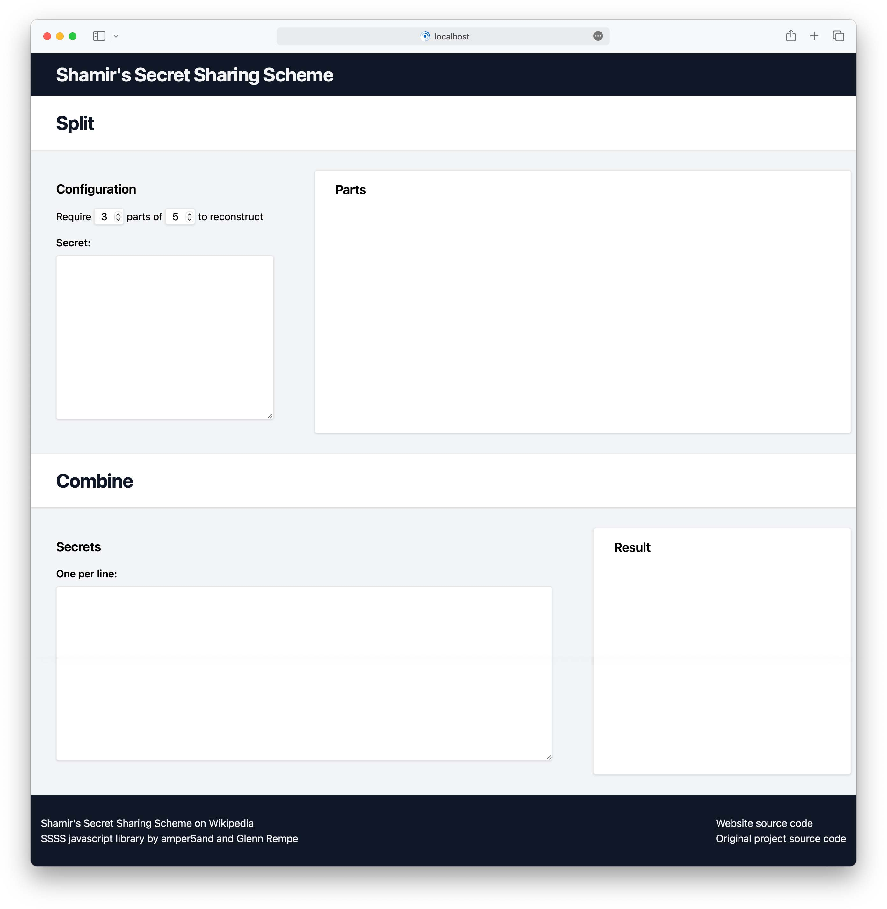

# About

A website for splitting secrets into parts or recreating secrets from existing parts.

# Preview



# Docker and source code

-   [Docker image](https://hub.docker.com/r/jordanroher/shamirs-secret-sharing-scheme)
-   [Source code on GitHub](https://github.com/notclickable-jordan/shamir)

# Docker compose

```yml
services:
    shamir:
        image: jordanroher/shamirs-secret-sharing-scheme
        ports:
            - 80:80
        restart: always
```

# Running locally

1. Start Tailwind
    ```bash
    npm run css
    ```
1. In another window, start the Express server
    ```bash
    npm run start
    ```
1. Navigate to http://localhost:8080

# Usage

## Splitting

Enter the text of your secret into the field.

Copy each individual part to a file.

Distribute the files.

## Combining

Gather enough parts to recreate the secret.

Enter the content from each part into the field.

The text of the secret will be displayed next to the field.

# License

MIT, see [license](https://github.com/iancoleman/shamir/blob/master/license) and [license2](./license2)
